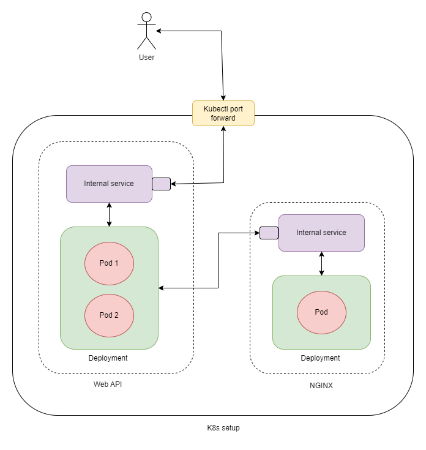

# Kubernetes setup for dotnet application

Welcome to the repo. This repo contains Kubernetes setup for

- NGINX-powered file server that responds to each request with a static JSON file
- Web API applications that can work simultaneously and make requests to the file server

### Overview
The overview of the K8s setup for the dotnet-based distributed application is as follows

💡NOTE: View the overview diagram in light mode

- It contains
    - dotnet (v3.1.1) based web API application with 2 simultaneously running instances
    - NGINX server with 1 instance



- Both dotnet web API and NGINX have separate internal services due to the ephemeral nature of the pods

- dotnet web API pod reaches the NGINX server pod using the [SRV record](https://kubernetes.io/docs/concepts/services-networking/dns-pod-service/#srv-records) of the NGINX server's internal service

- The SRV record of the NGINX server's internal service is exposed as an environment variable to the web API pod

- The NGINX server cannot be reached from outside the cluster

- The internal service of the web API is exposed through kubectl port forwarding for the users to access the application


### Running application locally

- Prerequisite
    - Docker
    - Minikube to run K8s locally

- Clone the repository and navigate to the root folder

- The list of commands to start the application is provided in `app-start.sh`
    - Run the following to start the application
    ```bash
        bash app-start.sh
    ```
    - This starts Minikube and the web API can be accessed through port `5001` using `kubectl` port forwarding
    - Following are the supported endpoints
    ```
        GET http://localhost:5001/weatherforecast
        GET http://localhost:5001/weatherforecast/stats
        GET http://localhost:5001/weatherforecast/fetch
    ```

- If you wish to stop the application, use `app-stop.sh` as follows
    ```bash
        bash app-stop.sh
    ```
    - ⚠️ The script to stop the Minikube and unset the Minikube's env variable to prevent pointing the shell to Minikube's docker-daemon uses the following
    ```bash
        unset `env|grep DOCKER|cut -d\= -f1`
    ```
    - 🛑 If you wish to continue using Minikube, don't use `app-stop.sh`